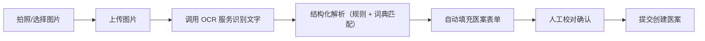
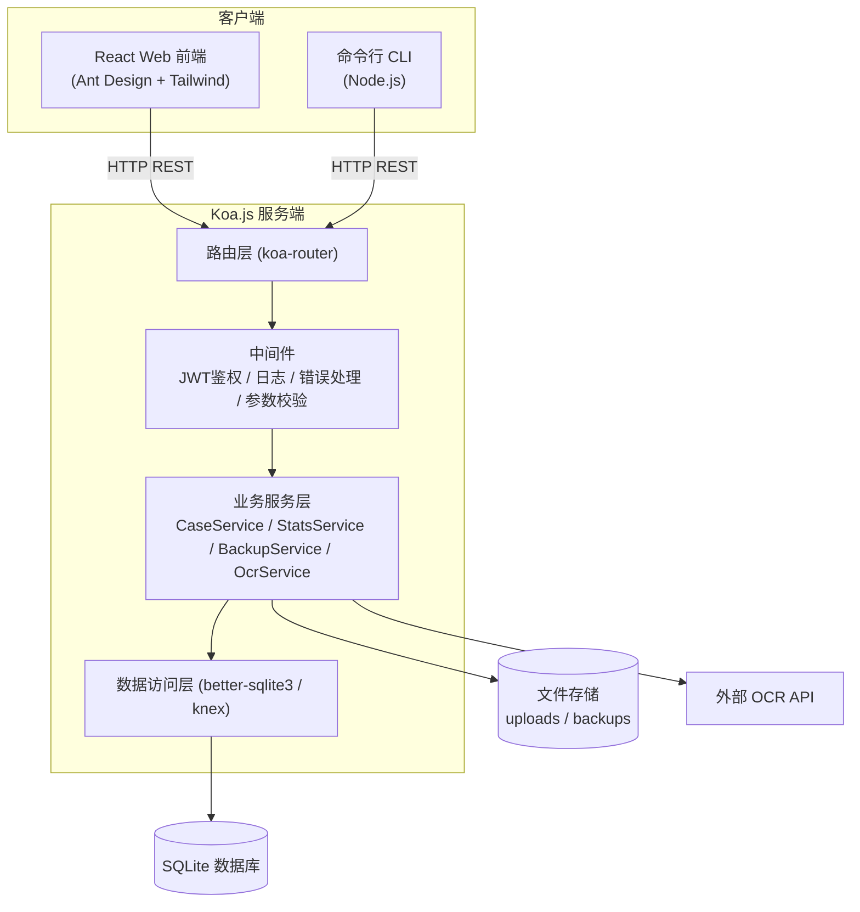

# 中医医案管理系统设计方案

> 版本：v1.0
> 撰写日期：2026-08-13
> 作者：产品架构组

---

## 一、项目概述

### 1.1 背景

中医医案是中医临床经验传承的核心载体。目前大量中医师的医案仍以纸质手写形式保存，存在以下痛点：

- 纸质医案易损毁、丢失，难以长期保存；
- 检索困难，无法按疾病、方药、时间等维度快速查找；
- 无法对临床经验进行统计分析，经验传承和学术研究效率低；
- 缺乏统一的数据备份机制。

### 1.2 目标

建设一套中医医案管理系统，实现：

1. **医案全生命周期管理**：拍照上传 → OCR 自动识别 → 人工校对 → 增删改查；
2. **多维度检索筛查**：按疾病名称、药物名称、时间、病人姓名等条件组合检索；
3. **统计分析**：对全部医案进行疾病分布、用药规律、疗效等多维度统计，支持数据导出下载；
4. **数据备份**：支持一键备份与定时自动备份，保障数据安全；
5. **扩展能力**：权限管理、操作日志、数据字典、疗效随访等。

### 1.3 技术栈

| 层次 | 技术选型 |
| --- | --- |
| 前端 | React.js + Ant Design + Tailwind CSS |
| 后端 | Node.js + Koa.js |
| 交互协议 | HTTP（RESTful API）+ 命令行 CLI |
| 数据库 | SQLite（单机/小团队默认，可平滑切换 MySQL） |
| 文件存储 | 本地磁盘（图片原件）+ 定期打包备份 |
| OCR 识别 | 云端 OCR API（可插拔，预留本地模型接口） |

---

## 二、核心数据模型设计

### 2.1 医案字段设计（核心）

医案（MedicalCase）是本系统的核心实体，字段按中医临床记录习惯分为六组：

#### （1）基本信息

| 字段 | 字段名 | 类型 | 说明 |
| --- | --- | --- | --- |
| 医案编号 | caseNo | string | 系统自动生成，如 YA20260813001 |
| 就诊日期 | visitDate | date | 本次诊病日期 |
| 医案类型 | caseType | enum | 初诊 / 复诊 |
| 医师姓名 | doctorName | string | 接诊医师 |
| 医案来源 | source | enum | 拍照上传 / 手工录入 |
| 备注 | remark | text | 自由备注 |

#### （2）患者信息

| 字段 | 字段名 | 类型 | 说明 |
| --- | --- | --- | --- |
| 患者姓名 | patientName | string | 支持脱敏展示 |
| 性别 | gender | enum | 男 / 女 |
| 年龄 | age | number | 岁 |
| 联系电话 | phone | string | 脱敏展示 |
| 既往史 | pastHistory | text | 既往疾病史 |

#### （3）四诊信息（望闻问切）

| 字段 | 字段名 | 类型 | 说明 |
| --- | --- | --- | --- |
| 主诉 | chiefComplaint | text | 患者主要不适及持续时间 |
| 现病史 | presentIllness | text | 疾病发生、发展、诊治经过 |
| 望诊 | inspection | text | 神色形态、舌象（舌质/舌苔） |
| 闻诊 | auscultation | text | 声音、气味 |
| 问诊 | inquiry | text | 寒热、汗、头身、二便、饮食、睡眠等 |
| 切诊 | palpation | text | 脉象（如：弦细、滑数） |

#### （4）诊断与辨证

| 字段 | 字段名 | 类型 | 说明 |
| --- | --- | --- | --- |
| 中医诊断 | tcmDiagnosis | string | 中医病名，如"胃脘痛" |
| 西医诊断 | westernDiagnosis | string | 西医病名，如"慢性胃炎"（可选） |
| 证型 | syndrome | string | 辨证分型，如"肝郁脾虚证" |
| 治法 | treatmentPrinciple | string | 如"疏肝健脾、和胃止痛" |

#### （5）处方信息（子表 PrescriptionItem）

| 字段 | 字段名 | 类型 | 说明 |
| --- | --- | --- | --- |
| 方剂名称 | formulaName | string | 如"柴胡疏肝散加减" |
| 药物明细 | items | 子表 | 药名、剂量（g）、脚注（先煎/后下等） |
| 剂数 | doses | number | 付数 |
| 用法用量 | usage | string | 如"每日一剂，水煎分早晚温服" |
| 医嘱 | advice | text | 饮食起居禁忌 |

#### （6）疗效与随访

| 字段 | 字段名 | 类型 | 说明 |
| --- | --- | --- | --- |
| 疗效 | outcome | enum | 痊愈 / 显效 / 有效 / 无效 / 未随访 |
| 随访记录 | followUps | 子表 | 随访日期、内容、转归 |
| 按语 | commentary | text | 医师按语/心得体会 |

#### （7）图片附件（子表 CaseImage）

| 字段 | 字段名 | 类型 | 说明 |
| --- | --- | --- | --- |
| 图片路径 | imagePath | string | 原始拍照件存储路径 |
| OCR 原文 | ocrText | text | OCR 识别出的原始文本 |
| 识别状态 | ocrStatus | enum | 待识别 / 已识别 / 识别失败 / 已校对 |

### 2.2 数据库表结构

```sql
-- 用户表
CREATE TABLE users (
  id INTEGER PRIMARY KEY AUTOINCREMENT,
  username TEXT UNIQUE NOT NULL,
  password_hash TEXT NOT NULL,      -- bcrypt 加密
  real_name TEXT,
  role TEXT DEFAULT 'doctor',        -- admin / doctor / readonly
  created_at DATETIME DEFAULT CURRENT_TIMESTAMP
);

-- 医案主表
CREATE TABLE medical_cases (
  id INTEGER PRIMARY KEY AUTOINCREMENT,
  case_no TEXT UNIQUE NOT NULL,
  visit_date DATE NOT NULL,
  case_type TEXT DEFAULT '初诊',
  doctor_name TEXT,
  source TEXT DEFAULT '手工录入',
  patient_name TEXT NOT NULL,
  gender TEXT,
  age INTEGER,
  phone TEXT,
  past_history TEXT,
  chief_complaint TEXT,
  present_illness TEXT,
  inspection TEXT,
  auscultation TEXT,
  inquiry TEXT,
  palpation TEXT,
  tcm_diagnosis TEXT,
  western_diagnosis TEXT,
  syndrome TEXT,
  treatment_principle TEXT,
  formula_name TEXT,
  doses INTEGER,
  usage_text TEXT,
  advice TEXT,
  outcome TEXT DEFAULT '未随访',
  commentary TEXT,
  remark TEXT,
  status TEXT DEFAULT '正常',         -- 正常 / 草稿 / 已归档
  created_by INTEGER,
  created_at DATETIME DEFAULT CURRENT_TIMESTAMP,
  updated_at DATETIME DEFAULT CURRENT_TIMESTAMP
);

-- 处方药物明细表
CREATE TABLE prescription_items (
  id INTEGER PRIMARY KEY AUTOINCREMENT,
  case_id INTEGER NOT NULL REFERENCES medical_cases(id) ON DELETE CASCADE,
  herb_name TEXT NOT NULL,            -- 药名
  dosage TEXT,                        -- 剂量，如 "10g"
  note TEXT,                          -- 脚注：先煎/后下/烊化等
  sort_order INTEGER DEFAULT 0
);

-- 图片附件表
CREATE TABLE case_images (
  id INTEGER PRIMARY KEY AUTOINCREMENT,
  case_id INTEGER REFERENCES medical_cases(id) ON DELETE SET NULL,
  image_path TEXT NOT NULL,
  ocr_text TEXT,
  ocr_status TEXT DEFAULT '待识别',
  uploaded_at DATETIME DEFAULT CURRENT_TIMESTAMP
);

-- 随访记录表
CREATE TABLE follow_ups (
  id INTEGER PRIMARY KEY AUTOINCREMENT,
  case_id INTEGER NOT NULL REFERENCES medical_cases(id) ON DELETE CASCADE,
  follow_date DATE NOT NULL,
  content TEXT,
  outcome TEXT
);

-- 数据字典表（疾病、药物、证型等标准词库）
CREATE TABLE dictionaries (
  id INTEGER PRIMARY KEY AUTOINCREMENT,
  dict_type TEXT NOT NULL,            -- disease / herb / syndrome / formula
  name TEXT NOT NULL,
  alias TEXT,                          -- 别名/俗名，逗号分隔
  category TEXT,                       -- 分类
  UNIQUE(dict_type, name)
);

-- 操作日志表
CREATE TABLE operation_logs (
  id INTEGER PRIMARY KEY AUTOINCREMENT,
  user_id INTEGER,
  action TEXT NOT NULL,               -- create / update / delete / export / backup
  target_type TEXT,
  target_id INTEGER,
  detail TEXT,
  created_at DATETIME DEFAULT CURRENT_TIMESTAMP
);

-- 常用检索索引
CREATE INDEX idx_cases_tcm_diagnosis ON medical_cases(tcm_diagnosis);
CREATE INDEX idx_cases_patient_name ON medical_cases(patient_name);
CREATE INDEX idx_cases_visit_date ON medical_cases(visit_date);
CREATE INDEX idx_prescription_herb ON prescription_items(herb_name);
```

---

## 三、功能设计

### 3.1 拍照上传 + OCR 自动识别建案

**流程：**



**要点：**

- 前端支持拖拽上传、多图上传（一案多图），上传后即时预览；
- 后端接收图片 → 存储到 uploads/ → 调用 OCR 服务（封装为可插拔 Provider，支持云端 OCR API，预留本地模型）；
- OCR 原文存入 case_images.ocr_text，再经**结构化解析器**将文本映射到医案字段：
  - 基于关键词模板匹配（如"主诉：""诊断：""处方："）切分段落；
  - 基于数据字典（疾病库、中药库）做实体识别，药名 + 剂量用正则提取（如"黄芪15g"）；
- 识别结果预填到表单，用户**必须人工校对**后才能提交，保证数据准确性；
- 识别失败时降级为手工录入，图片仍作为附件保留。

### 3.2 医案增删改查（CRUD）

- **新增**：表单录入 / OCR 识别录入两种入口；表单按"基本信息 → 患者 → 四诊 → 诊断辨证 → 处方 → 疗效"分步（Steps）展示，处方药物明细支持动态行编辑；
- **查询**：列表页支持分页、排序、多条件组合筛选；详情页完整展示医案 + 处方 + 图片附件 + 随访记录；
- **编辑**：字段级编辑，记录操作日志；支持草稿状态暂存；
- **删除**：默认软删除（归档），仅管理员可物理删除，删除需二次确认。

### 3.3 检索与筛查

| 检索维度 | 说明 |
| --- | --- |
| 疾病名称 | 中医诊断 / 西医诊断模糊匹配 |
| 药物名称 | 关联处方明细表，查出含某药的全部医案 |
| 时间范围 | 就诊日期起止筛选 |
| 病人姓名 | 模糊匹配 |
| 证型 / 治法 | 字典联动筛选 |
| 疗效 | 枚举筛选 |
| 医师 | 按接诊医师筛选 |
| 关键字全文 | 对主诉、按语等文本字段全文模糊搜索 |

以上条件可**自由组合**，接口统一为：
GET /api/cases?disease=&herb=&dateFrom=&dateTo=&patient=&syndrome=&outcome=&doctor=&keyword=&page=&pageSize=

### 3.4 统计分析与数据下载

**统计维度（首期）：**

1. 疾病谱统计：中医诊断 Top N 分布（柱状图/饼图）；
2. 用药规律：高频药物 Top N、常用药对（两药共现分析）；
3. 证型分布：各证型占比；
4. 疗效统计：分疾病的疗效构成（堆叠柱状图）；
5. 时间趋势：按月/年的医案量折线图；
6. 医师工作量：各医师医案量统计。

**技术方案：**

- 后端提供 /api/stats/* 聚合接口（SQL GROUP BY 聚合）；
- 前端用 Ant Design Charts（或 ECharts）渲染图表，统计页支持时间范围筛选联动；
- **数据下载**：支持将筛选结果/统计结果导出为 Excel（.xlsx）或 CSV；支持单条医案导出为结构化 JSON。

### 3.5 数据备份

- **手动备份**：CLI / 管理页一键备份，将数据库文件 + uploads/ 图片目录打包为 backup-YYYYMMDD-HHmmss.tar.gz，存入 backups/ 目录；
- **定时备份**：后端内置定时任务（node-cron），默认每日凌晨 2:00 自动备份，保留最近 30 份，可配置；
- **恢复**：提供 backup:restore 命令与接口，恢复前自动先做一份当前状态备份；
- **导出外置**：支持将备份文件下载到本地或推送至外部存储路径（可配置）。

### 3.6 建议增加的功能（经验补充）

1. **用户权限管理**：admin（全部权限）/ doctor（本人医案管理）/ readonly（仅查询统计），登录采用 JWT 鉴权；
2. **操作日志**：所有增删改、导出、备份行为留痕，满足追溯与合规要求；
3. **数据字典维护**：疾病、中药、证型、方剂标准词库的后台维护，供 OCR 解析和检索联动使用，保证统计口径一致；
4. **敏感信息脱敏**：患者姓名、电话在列表和导出中默认脱敏（如"张*"、"138****1234"），查看完整信息需权限并记录日志；
5. **处方模板**：常用处方保存为模板，录案时一键套用，提高录入效率；
6. **复诊关联**：同一患者的多次就诊医案建立关联链，形成完整诊疗时间轴；
7. **疗效随访提醒**：对"未随访"医案提供待办列表；
8. **批量导入**：支持 Excel 模板批量导入历史医案。

---

## 四、系统架构设计

### 4.1 总体架构



### 4.2 目录结构（建议）

```
中医医案管理系统/
├── docs/                      # 文档
├── server/                    # Koa 后端
│   ├── src/
│   │   ├── index.js           # 入口
│   │   ├── app.js             # Koa 实例与中间件装配
│   │   ├── config/            # 配置（端口、路径、OCR、备份策略）
│   │   ├── routes/            # 路由（cases/stats/auth/backup/dict...）
│   │   ├── controllers/       # 控制器
│   │   ├── services/          # 业务逻辑（含 OCR、备份、统计）
│   │   ├── models/            # 数据访问层
│   │   ├── middlewares/       # auth / error / validate / log
│   │   └── utils/             # 工具（脱敏、导出、正则解析）
│   ├── db/
│   │   ├── schema.sql         # 建表脚本
│   │   ├── migrate.js         # 初始化/迁移
│   │   └── seed.js            # 字典初始数据
│   ├── uploads/               # 上传图片
│   └── backups/               # 备份文件
├── web/                       # React 前端
│   ├── src/
│   │   ├── pages/             # 医案列表/详情/编辑/上传/统计/字典/用户/备份
│   │   ├── components/        # 表单、处方编辑器、图表等
│   │   ├── api/               # axios 封装
│   │   └── ...
├── cli/                       # 命令行工具
│   └── src/commands/          # case / stats / backup / import
└── package.json               # workspace 根配置
```

### 4.3 RESTful API 设计（核心）

| 方法 | 路径 | 说明 | 权限 |
| --- | --- | --- | --- |
| POST | /api/auth/login | 登录获取 JWT | 公开 |
| GET | /api/cases | 医案列表（多条件组合查询、分页） | 登录 |
| POST | /api/cases | 新建医案 | doctor+ |
| GET | /api/cases/:id | 医案详情 | 登录 |
| PUT | /api/cases/:id | 更新医案 | doctor+（本人或 admin） |
| DELETE | /api/cases/:id | 删除（归档）医案 | admin |
| POST | /api/cases/upload-image | 上传图片并触发 OCR，返回识别+解析结果 | doctor+ |
| GET | /api/cases/export | 导出筛选结果为 Excel/CSV | doctor+ |
| GET | /api/stats/overview | 总览统计（总量、本月新增等） | 登录 |
| GET | /api/stats/diseases | 疾病谱统计 | 登录 |
| GET | /api/stats/herbs | 高频药物 / 药对统计 | 登录 |
| GET | /api/stats/syndromes | 证型分布 | 登录 |
| GET | /api/stats/outcomes | 疗效统计 | 登录 |
| GET | /api/stats/trend | 时间趋势 | 登录 |
| GET/POST/PUT/DELETE | /api/dicts | 数据字典管理 | admin 写 / 登录读 |
| POST | /api/backup | 触发备份 | admin |
| GET | /api/backup/list | 备份列表 | admin |
| POST | /api/backup/restore | 从备份恢复 | admin |
| GET/POST/PUT/DELETE | /api/users | 用户管理 | admin |
| GET | /api/logs | 操作日志查询 | admin |

**统一响应格式：**

```json
{ "code": 0, "message": "ok", "data": {} }
```

### 4.4 CLI 设计

CLI 与 Web 前端走同一套 HTTP API（携带 Token），保证逻辑单一来源：

```bash
# 认证
tcm-case login -u <username>

# 医案操作
tcm-case case list --disease 胃脘痛 --herb 黄芪 --from 2026-01-01 --to 2026-08-01
tcm-case case get <caseNo>
tcm-case case create --file case.json
tcm-case case upload <imagePath>          # 上传图片走 OCR 建案
tcm-case case delete <caseNo>

# 统计与导出
tcm-case stats overview
tcm-case stats herbs --top 20
tcm-case export --disease 咳嗽 -o result.xlsx

# 备份
tcm-case backup create
tcm-case backup list
tcm-case backup restore backup-20260813.tar.gz

# 批量导入
tcm-case import cases.xlsx
```

### 4.5 前端页面设计

| 页面 | 主要内容 |
| --- | --- |
| 登录页 | 账号密码登录 |
| 工作台 | 关键指标卡片（医案总数、本月新增、待随访数）、快捷入口 |
| 医案列表 | 筛选区（疾病/药物/日期/患者/证型/疗效）+ 表格 + 批量导出 |
| 拍照上传 | 图片上传 → OCR 进度 → 识别结果对照预览 → 表单校对提交 |
| 医案编辑 | 分步表单（Steps），处方动态行编辑器，模板套用 |
| 医案详情 | 完整医案 + 原图对照 + 随访时间轴 + 操作记录 |
| 统计分析 | 多图表看板，时间范围联动，一键导出 |
| 数据字典 | 疾病/中药/证型/方剂词库维护 |
| 系统管理 | 用户管理、备份管理、操作日志 |

UI 规范：Ant Design 组件为主体（Table、Form、Steps、Upload、Statistic），Tailwind 负责布局与间距微调，不重复造组件；整体走简洁、信息密度合理的工具型风格。

---

## 五、安全与合规

1. 密码 bcrypt 加密存储；接口 JWT 鉴权，Token 过期刷新；
2. 患者敏感信息（姓名、电话）列表与导出默认脱敏；
3. 删除为软删除，物理删除仅 admin；
4. 全量操作日志留痕；
5. 备份文件命名含时间戳，恢复前自动留存当前快照；
6. 上传文件类型/大小白名单校验（仅 jpg/png/webp，不超过 10MB）；
7. 接口参数统一校验（zod / joi），防注入使用参数化查询。

---

## 六、实施计划（里程碑）

| 阶段 | 内容 | 产出 |
| --- | --- | --- |
| M1 基础骨架 | 工程初始化、数据库、鉴权、医案 CRUD | 可用 API + 基础前端 |
| M2 核心闭环 | 拍照上传 + OCR 识别 + 校对建案 | 核心业务流程打通 |
| M3 检索统计 | 组合检索、统计看板、数据导出 | 完整查询分析能力 |
| M4 运维增强 | 备份/恢复、字典、日志、权限细化、CLI | 生产可用 |
| M5 体验优化 | 处方模板、复诊关联、随访提醒、批量导入 | 增值功能 |

详细任务拆分见 [todos.md](./todos.md)。
