# 中医医案管理系统 · 操作入门帮助文档

> 本文档面向「中医医案管理系统」（以下简称"医案系统"）的**首次使用者**，按"打开 → 看 → 查 → 建 → 编辑 → 数据字典 → 系统管理"的实际使用动线，配合 12 张操作截图，从零到一走通整个系统。

---

## 📑 目录

1. [什么是中医医案管理系统](#1-什么是中医医案管理系统)
2. [5 分钟上手：动线总览](#2-5-分钟上手动线总览)
3. [第一步：在 ClawDao 龙虾岛中打开应用](#3-第一步在-clawdao-龙虾岛中打开应用)
4. [第二步：进入工作台](#4-第二步进入工作台)
5. [第三步：拍照建案（推荐上手路径）](#5-第三步拍照建案推荐上手路径)
6. [第四步：在医案管理中查看 / 检索 / 编辑](#6-第四步在医案管理中查看--检索--编辑)
7. [第五步：编辑医案（6 步向导）](#7-第五步编辑医案6-步向导)
8. [第六步：维护数据字典](#8-第六步维护数据字典)
9. [第七步：系统管理（用户 / 备份 / 日志）](#9-第七步系统管理用户--备份--日志)
10. [进阶玩法：交给"数字员工"自动录入](#10-进阶玩法交给数字员工自动录入)
11. [常见问题 FAQ](#11-常见问题-faq)
12. [快捷键与术语表](#12-快捷键与术语表)

---

## 1. 什么是中医医案管理系统

**中医医案管理系统**是 ClawDao 生态下的一个本地应用，定位为：

- **面向对象**：中医师 / 中医诊所 / 跟诊学员
- **核心功能**：把传统纸质的「跟诊记录表 / 门诊病历」电子化、结构化、可检索

它有 3 个特别的能力：

| 能力 | 说明 |
| --- | --- |
| 🖼 **拍照建案** | 用手机 / 相机拍下纸质病历 → 自动 OCR 识别 → 一键预填表单 |
| 🤖 **AI 录入** | 通过 ClawDao 龙虾岛的"数字员工"，让大模型直接读取图片并写入系统 |
| 📊 **统计 / 字典** | 内置疾病、中药、证型、方剂的本地字典，方便后续做数据统计 |

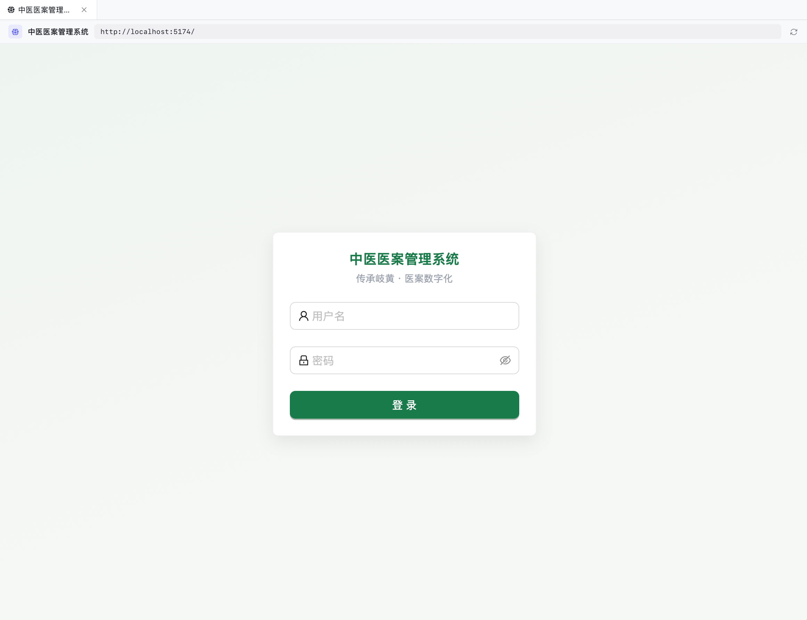

*（图 1：医案系统在 ClawDao「我的应用」列表中，标签：中医 · 医案 · OCR · 统计）*

---

## 2. 5 分钟上手：动线总览

如果你只有 5 分钟，请严格按下面的顺序操作：

```
打开 ClawDao 龙虾岛
   ↓
「我的应用」里点 中医医案管理系统 卡片上的「运行」
   ↓
运行中 → http://localhost:5174/
   ↓
点击卡片上的「主页」按钮（或直接打开浏览器）
   ↓
进入 工作台 → 拍照建案 → 上传病历照片 → 校对 → 保存
   ↓
回到 工作台，看到「待随访医案」多了一条 ✅
```

> 💡 如果「运行」按钮点了没反应（一直是灰色"已下载"），去 ClawDao「老板」页面，吩咐「老板」把安装和初始化处理好。

下面用 4 张截图把整个 5 分钟动线拆给你看，每一步都标了序号，跟着做就行：

**① 选择已下载的应用** — 在「应用」标签下找到「中医医案管理系统」卡片。

**② 展开侧栏浏览器** — 在左侧导航打开「浏览器」，便于随时回到龙虾岛主界面。

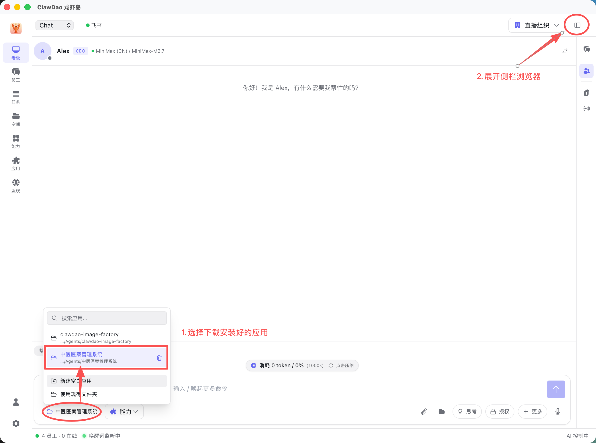

*（图 2-1：找到「中医医案管理系统」应用卡片，并展开侧栏浏览器）*

**③ 点击「启动」按钮，看到启动之后，点击「主页」按钮** — 首次启动会先安装依赖，启动成功后卡片状态变为「运行中 → http://localhost:5174/」，再点「主页」即可在侧栏浏览器中打开登录页。

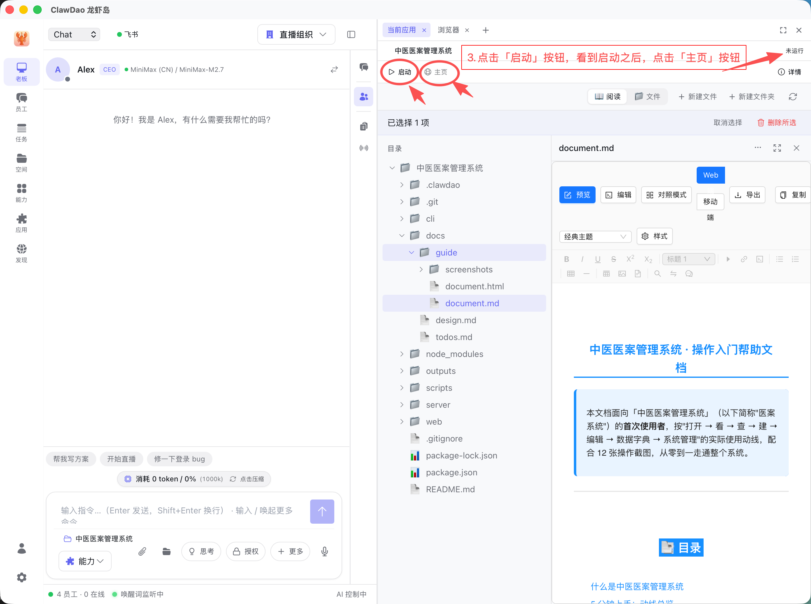

*（图 2-2：点击「启动」按钮，启动完成后点击「主页」）*

**④ 输入默认用户名和密码：admin / admin123 登录系统** — 首次登录进入工作台。

> 🟢 **这是"手动操作"入口**：传统软件的方式，全程不消耗 Token，适合第一次熟悉系统的同学。系统主标语是「传承岐黄 · 医案数字化」。

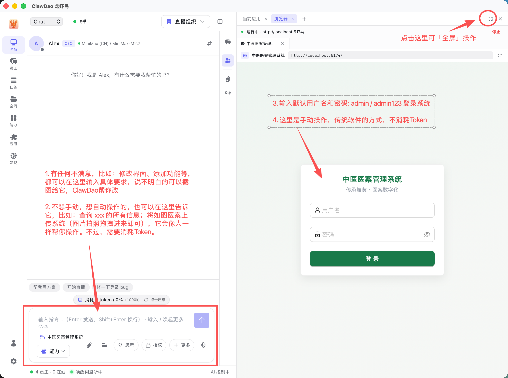

*（图 2-3：在登录页输入 admin / admin123 进入工作台 — 红框标注的 4 条提示告诉你在龙虾岛里还能做什么）*

**⑤（可选）把操作交给"数字员工"** — 在 Chat 里直接跟 Alex 说：

```
请将图片内容识别，并写入医案系统；同时把图片作为记录的附件上传或做好链接
```

数字员工会按 20 步流程自动执行：读取图片 → OCR 识别 → 调 API 写入医案系统 → 上传图片 → 反馈结果。

> 🟢 **图 2-4 红框提示**：所有操作都可以在这里交给「数字员工」处理，省掉手工录入；但会消耗 Token。
> 🟢 一次会话建议只做一个完整任务，方便追溯步骤（如图中的「执行步骤 20/20」）。

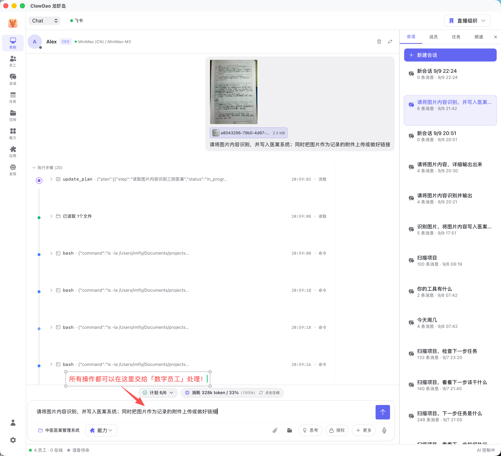

*（图 2-4：在 Chat 中下达指令，让 Alex 自动完成"识别图片 → 写入医案系统"）*

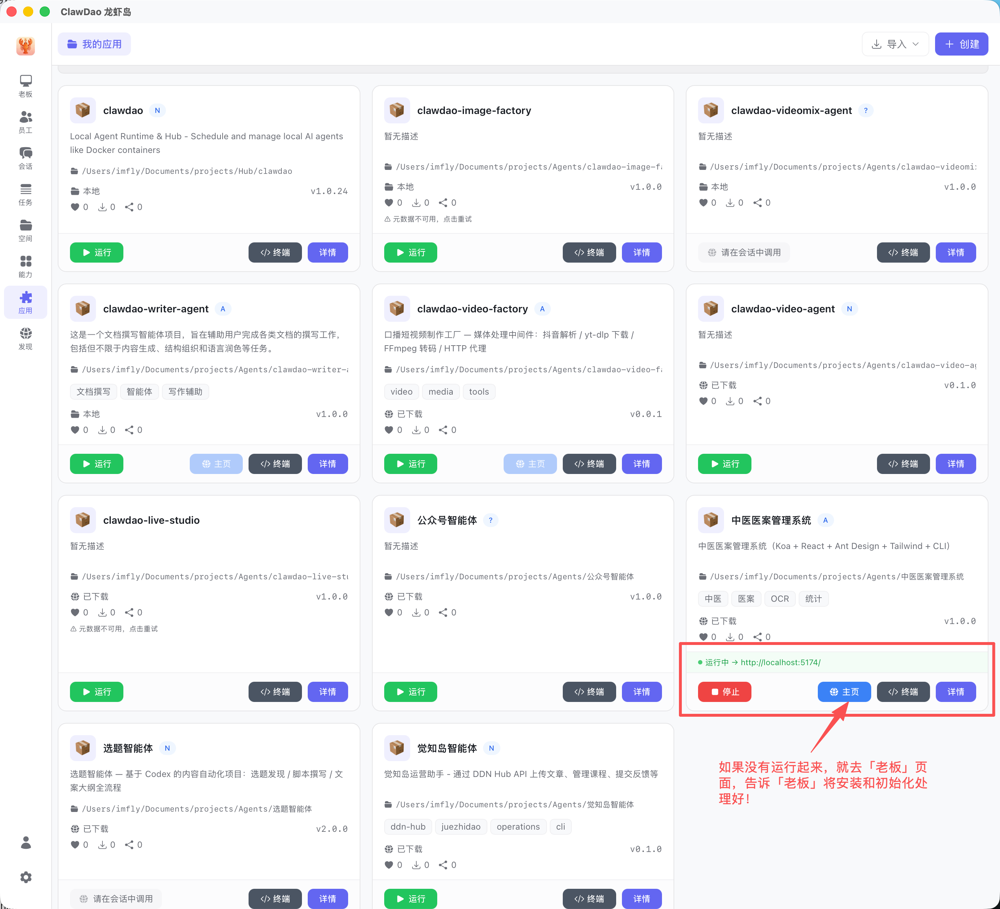

*（图 2-5：医案系统启动后的最终效果，URL 是 http://localhost:5174/；这里是第二入口 — 若启动后没反应，去"老板"页面让数字员工初始化）*

---

## 3. 第一步：在 ClawDao 龙虾岛中打开应用

医案系统不是一个独立的桌面 App，它是 **ClawDao 龙虾岛**里的一个"应用"（类似 Docker 容器）。所以，第一步永远是先打开龙虾岛。

### 3.1 找到入口【这个是直接入口，什么时候都能用】

打开 ClawDao 龙虾岛 → 左侧菜单 → **应用**（puzzle 图标）→ 顶部出现 **我的应用** 列表。

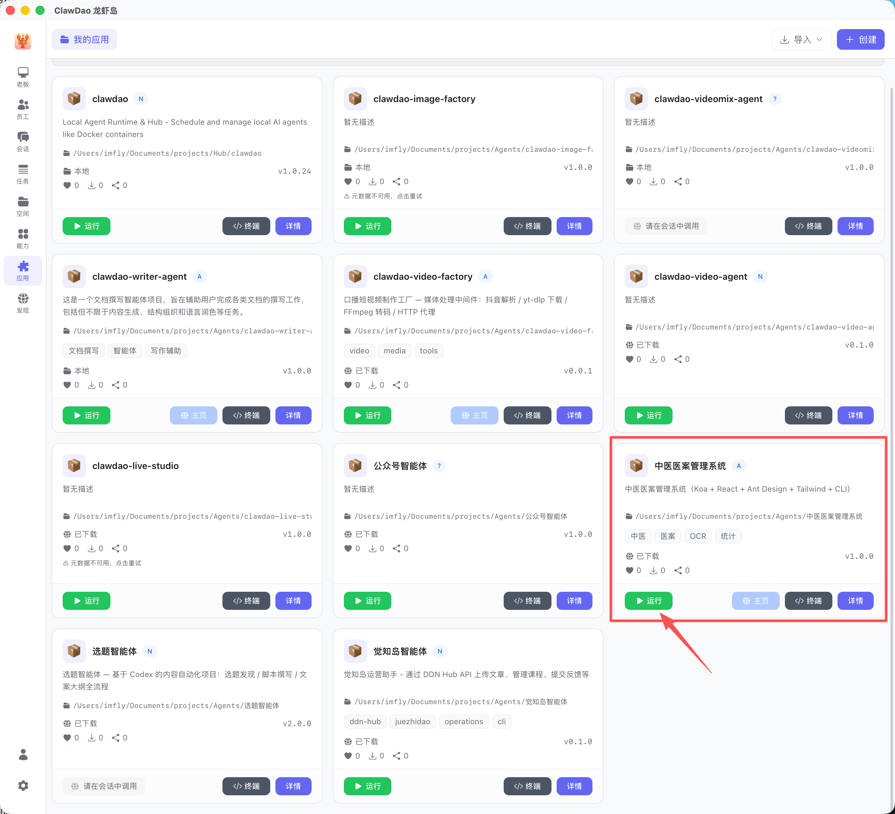

你应该能看到一张卡片写着「中医医案管理系统」：

- 标签：**中医 · 医案 · OCR · 统计**
- 描述：中医医案管理系统（Koa + React + Ant Design + Tailwind + CLI）
- 状态：本地 / v1.0.0

### 3.2 启动应用

点击卡片左下角的 **▶ 运行** 按钮。

- 首次运行会先做依赖安装（Koa 后端 + Vite 前端），需要 30 秒～2 分钟。
- 运行成功后，卡片状态从「已下载」变成 **绿色"运行中 → http://localhost:5174/"**，并出现 **停止 / 主页 / 终端 / 详情** 四个按钮。


> 4 个按钮的作用：
>
> | 按钮 | 干什么 |
> | --- | --- |
> | **停止** | 关闭服务，释放端口 |
> | **主页** | 在龙虾岛内置浏览器里打开 http://localhost:5174/ |
> | **终端** | 打开项目根目录的 shell（看日志、改配置） |
> | **详情** | 看 README、版本号、目录路径 |

### 3.3 故障排除

如果点了"运行"卡片没反应：

1. 去左侧 **老板** 页面，跟"老板"说："把『中医医案管理系统』安装好并启动"。
2. 或者去 **终端**，手动执行 `cd /Users/imfly/Documents/projects/Agents/中医医案管理系统 && pnpm dev`。
3. 端口冲突时改 `vite.config.ts` 的 `server.port`。

---

## 4. 第二步：进入工作台

应用打开后，默认就停在 **工作台** 页面。它是整个系统的"仪表盘"。

### 4.1 左侧菜单（6 项）

```
工作台     ← 你现在在这里（默认页）
医案管理   ← 病历列表、检索、详情、编辑
拍照建案   ← 上传纸质病历照片
统计分析   ← 病种 / 用药 / 疗效分布
数据字典   ← 维护 疾病 / 中药 / 证型 / 方剂
系统管理   ← 用户、备份、操作日志
```

### 4.2 顶部 4 张数据卡

| 指标 | 含义 | 示例值 |
| --- | --- | --- |
| 🗂 **医案总数** | 系统中所有病历的总数 | 45 |
| ➕ **本月新增** | 当月新建的医案数 | 0 |
| ⏰ **待随访** | 标记为"未随访"的医案数 | 9 |
| 👤 **患者人数** | 不重复的患者总数 | 19 |

> 工作台上的数字会随你的操作实时更新。

### 4.3 待随访医案列表

页面中间是 **「待随访医案」** 列表，每行展示：

- 患者姓名 + 主病 / 主诉标签（绿色徽标）
- 就诊日期 · 接诊医师 · 医案编号
- 右侧的 **「未随访」橙色标签**

> 🟢 **图中红框标注**：这一栏的数据多数是 **AI 自动识别添加的**（即通过拍照建案 + OCR 写入的）。如果你点了列表项，会直接跳到该医案的详情页。

### 4.4 快捷操作（右侧）

| 按钮 | 用途 |
| --- | --- |
| ➕ **手工录入医案** | 老式表单逐字段录入 |
| 📷 **拍照识别建案** | 上传纸质病历 → OCR |
| 📊 **查看统计分析** | 跳到统计页 |

> 🟢 **小贴士**：刚接触系统时，从 **「手工录入医案」** 进入最稳；熟练后改为 **「拍照识别建案」** 效率最高。

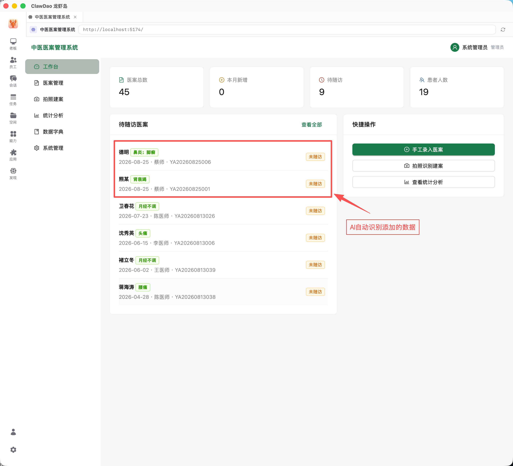
*（图 3：工作台；红框标出"AI 自动识别添加的数据"）*

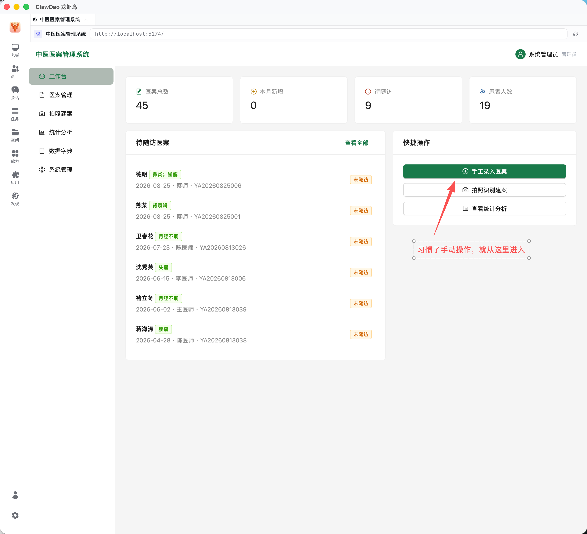
*（图 4：习惯了手动操作，就从右侧「手工录入医案」入口进入）*

---

## 5. 第三步：拍照建案（推荐上手路径）

> 这是医案系统最有特色的功能：**把纸质病历拍照，让系统自动识别并预填表单**。

### 5.1 找到入口

左侧菜单 → **拍照建案**（相机图标）。

### 5.2 上传照片

页面中央是一个 **虚线框的上传区**：

- **支持格式**：jpg / png / webp
- **大小限制**：单张不超过 **10MB**
- **方式 1**：点击虚线框 → 弹出文件选择器 → 选图片
- **方式 2**：直接把纸质病历的照片 **拖拽** 到虚线框里

> 💡 拍照小技巧：把纸摊平、光线均匀、避免反光；尽量让"跟诊记录表"的整个表格都在画面里，OCR 准确率最高。

### 5.3 自动 OCR 识别

上传后，系统会自动跑一遍 OCR，把图片中的字段提取出来。识别成功后：

- 顶部出现绿色提示：「✅ 识别完成。请务必逐项校对识别结果后再提交，识别有误之处请直接修改。」
- 页面分两栏：
  - **左**：原始图片（病历原件，便于和识别结果对照）
  - **左下**：OCR 识别原文（一段纯文本，方便排查识别错误）
  - **右**：**校对医案信息**（分 6 步的表单，已自动填充识别结果）

### 5.4 6 步校对表单

右上角有 6 个步骤指示器：

```
1 基本信息 → 2 患者信息 → 3 四诊信息 → 4 诊断辨证 → 5 处方信息 → 6 疗效随访
```

前 4 步在识别成功后显示 **绿色 ✓** 表示已完成识别，可以直接修改；第 5 步（处方信息）当前正在校对中，第 6 步（疗效随访）尚未识别。

**第 5 步「处方信息」界面**包含：

- **方剂名称**：例 "柴胡疏肝散加减"
- **剂数**：例 7
- **用法用量**：例 "每日一剂，水煎分早晚温服"
- **医嘱**：例 "忌食生冷辛辣，调畅情志"
- **药物明细表格**：
  - 复选框 / 药名 / 剂量 / 脚注选择 / 删除按钮
  - 可点击「**+ 添加药物**」新增行
  - 可点击「**套用模板**」一键填入常用方剂的药物列表
  - 可点击「**存为模板**」把当前处方保存为模板供后续复用

### 5.5 提交

每一步都有「**上一步 / 下一步**」按钮。第 6 步点「**完成**」即保存一条新医案。

> ⚠️ **当前演示数据是模拟的**：截图里红字标注"没有 OCR 模型，识别数据是模拟数据"。在正式使用前，需要在项目 `server/` 下配置真实 OCR（如 PaddleOCR / 百度 OCR / 通义千问 VL），否则识别结果可能是 mock 数据。

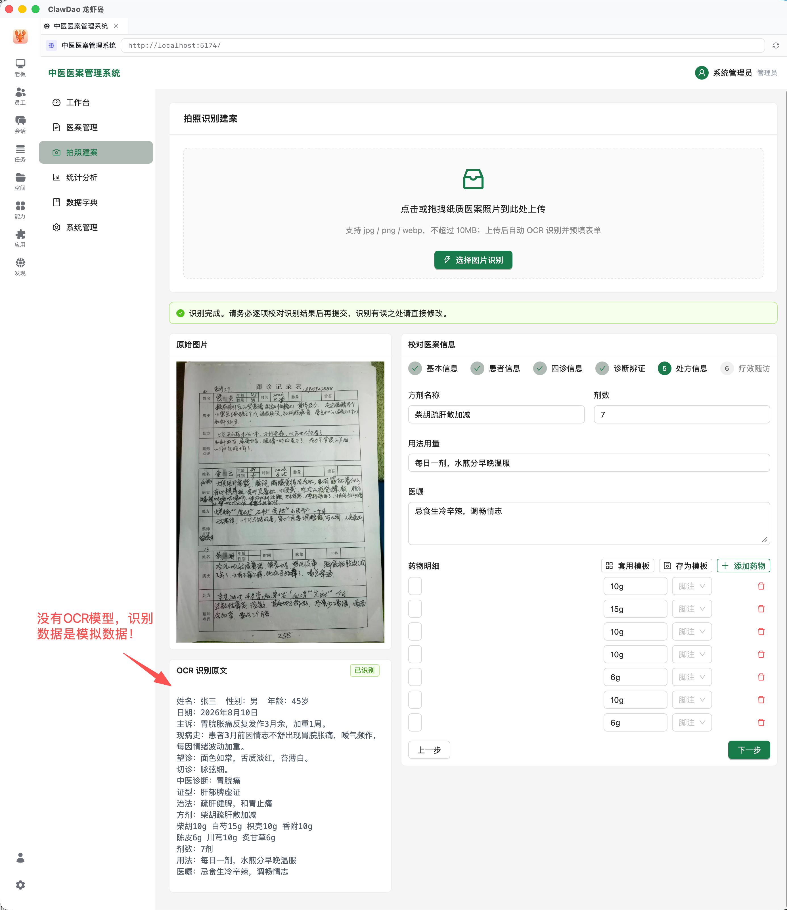

*（图 5：拍照建案 — 左侧原始病历 + OCR 原文，右侧 6 步校对表单，第 5 步处方信息中）*

---

## 6. 第四步：在医案管理中查看 / 检索 / 编辑

### 6.1 进入列表

左侧菜单 → **医案管理**（文件夹图标）。

### 6.2 顶部检索栏

页面顶部有 9 个检索条件 + 2 个按钮：

| 检索项 | 类型 | 说明 |
| --- | --- | --- |
| 疾病名称 | 文本 | 中医病名（如 "水肿"、"腰痛"） |
| 药物名称 | 文本 | 中药名 |
| 病人姓名 | 文本 | 患者姓名 |
| 开始日期 / 结束日期 | 日期 | 就诊日期区间 |
| 证型 | 下拉 | 肝郁脾虚证、肾虚衰微 等 |
| 疗效 | 下拉 | 治愈 / 好转 / 无效 |
| 医师 | 文本 | 接诊医生 |
| 关键字 | 文本 | 全字段模糊检索（兜底） |

填好条件 → 点击 **🔍 查询**；想清空 → 点击 **⟲ 重置**。

### 6.3 列表展示

每行 8 列：

```
医案编号 | 就诊日期 | 患者 | 性别 | 年龄 | 中医诊断 | 证型 | 方剂 | 操作
```

- 「中医诊断」用绿色徽标显示病名（如 "水肿"、"肾衰竭"、"腰痛"）
- 「证型 / 方剂」超出宽度会被截断（hover 看完整）
- 「操作」列固定有 2 个链接：**详情** / **编辑**

底部右侧的分页器：**共 45 条 · 10 条/页 · 1 2 3 4 5**。

### 6.4 列表右上角两个按钮

- ⬇ **导出 Excel**：把当前筛选结果导出为 .xlsx，做科研统计或交接用
- ➕ **新建医案**：跳到新建向导（效果等同于点击「详情 → 编辑」后切换到第 1 步"基本信息"为空状态）

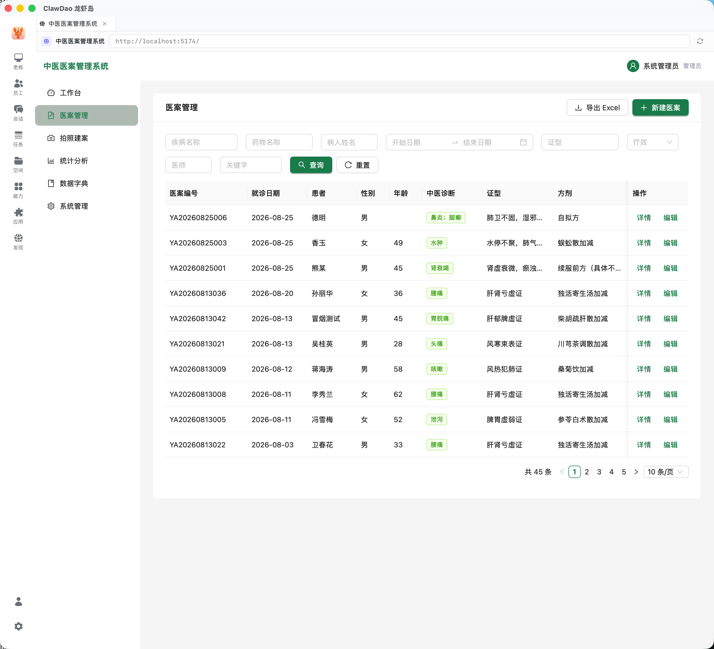

*（图 6：医案管理列表视图，9 个检索条件 + 表格 + 分页）*

### 6.5 查看详情（点 "详情"）

进入详情页，按区块展示（不可编辑）：

```
┌─ 医案详情 YA20260825006 ──────────  [编辑] [导出 JSON] [删除] [彻底删除]
│
│ 🟢 基本信息          医案编号 / 就诊日期 / 医案类型 / 接诊医师 / 医案来源
│ 🟢 患者信息          姓名 / 性别 / 年龄 / 联系电话 / 既往史
│ 🟢 四诊信息          主诉 / 现病史 / 望诊 / 闻诊 / 问诊 / 切诊
│ 🟢 诊断辨证          中医诊断 / 西医诊断 / 证型 / 治法
│ 🟢 处方信息          方剂名称 / 剂数 / 用法用量 / 医嘱 / 药物明细表
│ 🟢 疗效随访          疗效标签 / 按语 / 备注
│ 🟢 随访记录          [暂无随访记录 · 点击 +添加随访]
│ 🟢 图片附件与历史就诊   原始病历图 / 同一患者历史就诊
└───────────────────────────────────────────────────────────
```

> 🟢 **AI 自动识别的字段可能有误**：如果发现 AI 填错（例如方剂剂量错了），点右上角 **「编辑」** → 修改 → 「保存」。
> 🟢 **底部「图片附件」是原始病历照片**：永远保留，便于后续翻阅与核对。

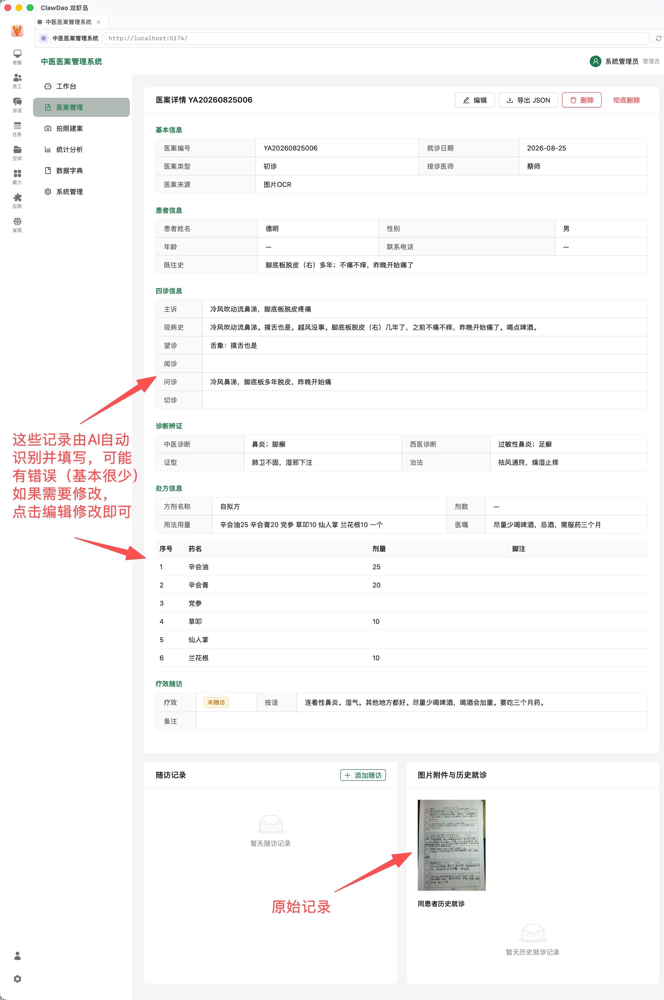

*（图 7：医案详情页；红框说明 "AI 自动识别并填写，可点击编辑修改"；底部"原始记录"指向纸质病历图片）*

---

## 7. 第五步：编辑医案（6 步向导）

点详情页右上 **编辑**，或新建医案，会进入 **6 步分步表单向导**：

```
[① 基本信息] ─── [② 患者信息] ─── [③ 四诊信息] ─── [④ 诊断辨证] ─── [⑤ 处方信息] ─── [⑥ 疗效随访]
   ✓ 已完成           ✓ 已完成         ✓ 已完成         ✓ 已完成         ← 当前        →  待完成
```

> 步骤条用 **绿色填充数字 + 灰色数字** 区分当前和未完成。

### 7.1 步骤 ① 基本信息

| 字段 | 必填 | 说明 |
| --- | --- | --- |
| **就诊日期** | ✅ 红星 | 日期选择器，格式 YYYY-MM-DD |
| 医案类型 |  | 下拉：初诊 / 复诊 |
| 接诊医师 |  | 文本，默认填当前登录账号名 |
| 医案来源 |  | 下拉：手工录入 / 图片 OCR / AI 录入 / 其他 |

### 7.2 步骤 ② 患者信息

- 患者姓名（必填）
- 性别（下拉：男 / 女 / 未知）
- 年龄（数字，单位岁）
- 联系电话
- 既往史（多行文本）

### 7.3 步骤 ③ 四诊信息

6 个字段一一对应中医四诊：

- **主诉**（必填，一句话概括）
- **现病史**（必填，多行）
- **望诊**（面色、形态、舌象等）
- **闻诊**（声音、气味）
- **问诊**（寒热、汗、饮食、二便等）
- **切诊**（脉象）

### 7.4 步骤 ④ 诊断辨证

- 中医诊断（病名，可选多个）
- 西医诊断
- 证型
- 治法

> 这 4 项都可点击 **「+」** 按钮调用数据字典做下拉联想。

### 7.5 步骤 ⑤ 处方信息

参考 [§5.4](#54-6-步校对表单) 中关于「处方信息」的描述，此处完全相同。

### 7.6 步骤 ⑥ 疗效随访

- 疗效（下拉：治愈 / 好转 / 未愈 / 未知）
- 按语（医嘱、注意事项、生活调摄）
- 备注

最后一步点 **「完成」**，医案写入数据库，回到列表或工作台。

> 🟢 **左下角「上一步」永远可以回退** 修改之前的步骤；中途离开浏览器不会丢失数据（前端有本地草稿）。

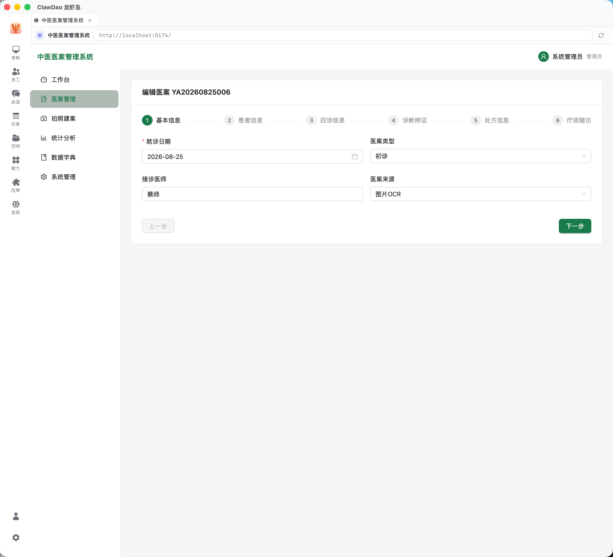

*（图 8：编辑医案 6 步向导 — 第 1 步「基本信息」）*

---

## 8. 第六步：维护数据字典

数据字典是系统的"词库"，**所有下拉选项都从这里来**。维护好字典，录入时能少打字、少出错。

### 8.1 进入数据字典

左侧菜单 → **数据字典**（📖 图标）。

### 8.2 4 个分类 Tab

| Tab | 维护内容 |
| --- | --- |
| **疾病** | 中医病名 + 别名 + 分类 |
| **中药** | 药名 + 性味 + 归经 + 别名 |
| **证型** | 证型名 + 描述 |
| **方剂** | 方名 + 组成药物 + 功效 + 模板 |

> 当前默认显示「疾病」Tab。

### 8.3 检索 / 新增 / 编辑 / 删除

- 顶部搜索框：按名称或别名模糊检索
- **🔍 搜索** / **+ 新增** 按钮在右上角
- 列表行尾的 **编辑 / 删除** 链接

当前「疾病」Tab 共 60 条记录（如：不寐、中风、乳痛、产后腹痛、便秘、健忘、内伤发热、厌食、口疮、呃逆、呕吐、咳嗽、咽喉肿痛、哮病、喘证 等）。

### 8.4 操作建议

- **录入 10 条以上医案后**，回头补一下字典：把常用的病名 / 方剂维护进来。
- **数据字典 → 方剂 → 存为模板**：把科室常用方做成模板，下次拍照建案时"套用模板"一键填入。

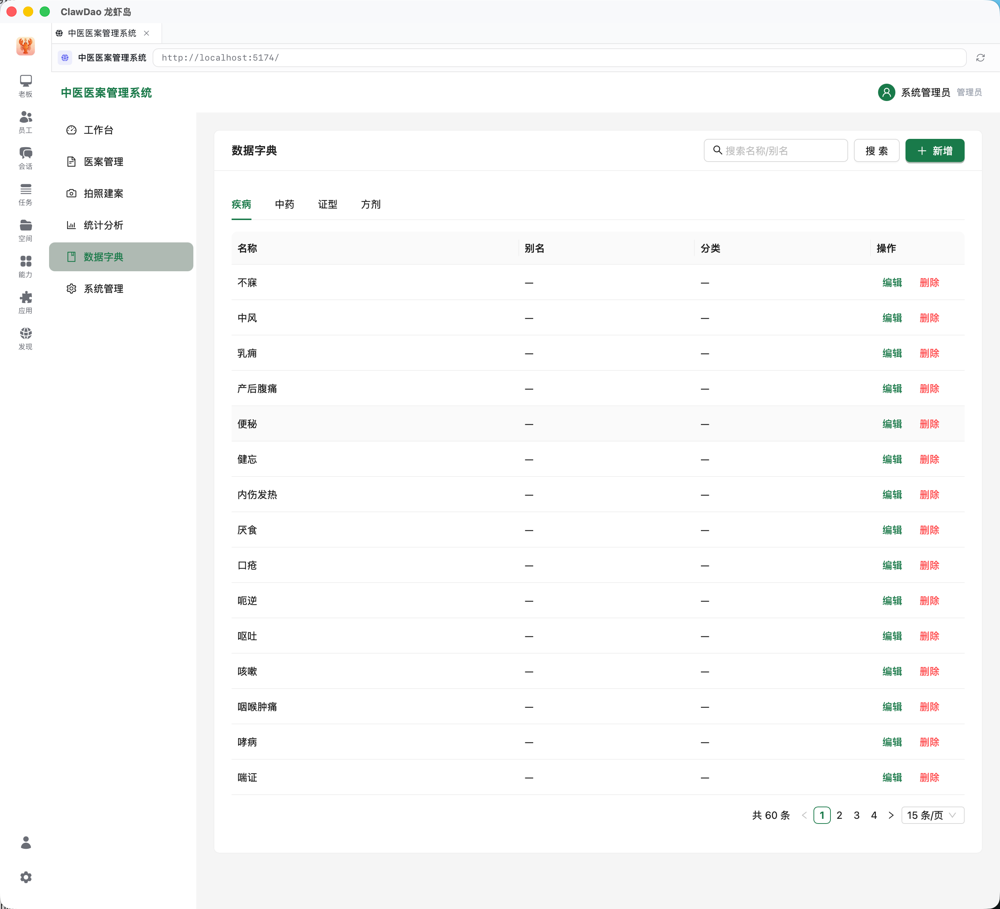

*（图 9：数据字典 — 疾病 Tab，60 条记录，可增删改查）*

---

## 9. 第七步：系统管理（用户 / 备份 / 日志）

左侧菜单 → **系统管理**（⚙ 图标）。包含 3 个 Tab：

### 9.1 用户管理

- 列表字段：用户名 / 姓名 / 角色 / 创建时间 / 操作
- 默认有一个超级管理员：`admin / 系统管理员 / 管理员 / 2026-08-13 08:27:54`
- 右上角 **+ 新增用户** 按钮

> 🟢 **建议给每位医师开一个独立账号**：方便日志追溯，也方便后续做"按医师统计"。

### 9.2 数据备份

> 当前未在截图中展开。功能包括：
> - 一键导出整库为 `.sql` / `.json`
> - 选择性导出某段时间 / 某医师 / 某病种的医案
> - 上传备份恢复

### 9.3 操作日志

> 当前未在截图中展开。记录所有用户的增删改查动作，便于审计。

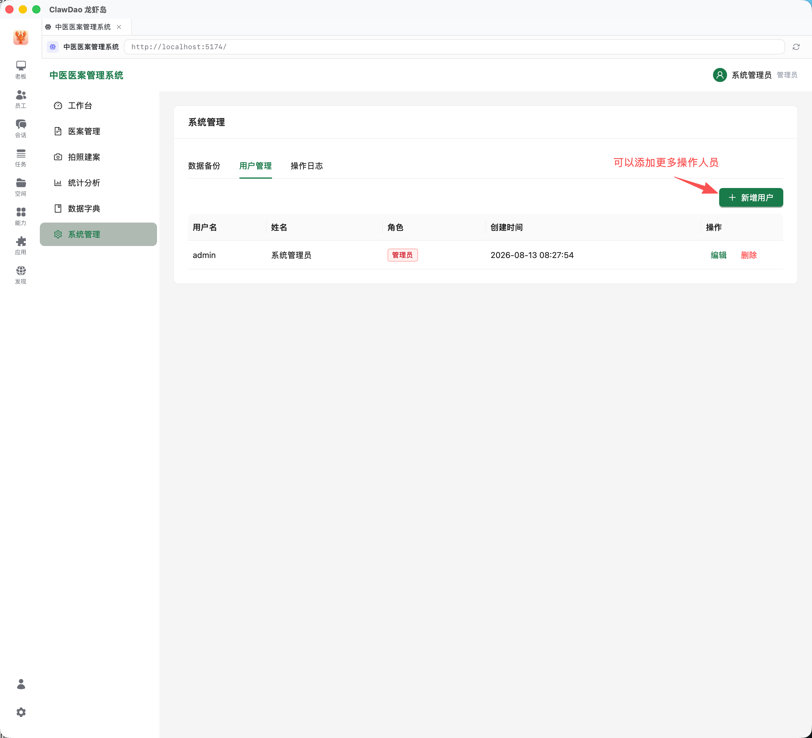

*（图 10：系统管理 → 用户管理；红字提示"可以添加更多操作人员"）*

---

## 10. 进阶玩法：交给"数字员工"自动录入

> 医案系统已经接入 ClawDao 的"数字员工"（AI Agent），可以**让 AI 直接读图片 + 写入数据库**。

### 10.1 场景演示

打开 ClawDao 龙虾岛 → **会话** → 选一个数字员工（比如 Alex）→ **开启 Chat**。

在输入框下方有 **能力** 下拉按钮，可以看到 **「中医医案管理系统」** 这个能力。把它点亮。

在输入框中：

```
[拖入一张纸质病历的照片]
[点击能力按钮，选择 中医医案管理系统]
请将图片内容识别，并写入医案系统；同时把图片作为记录的附件上传或做好链接
```

数字员工就会自动：

1. 调用 OCR 能力识别图片
2. 调用医案系统的 API 写入数据库
3. 把图片上传 / 关联为附件
4. 给你反馈"已写入医案 YA20260825006"

### 10.2 三种录入方式对比

| 方式 | 谁在干活 | 适合场景 |
| --- | --- | --- |
| 🧑‍⚕️ **手工录入** | 你自己 | 病历复杂、需要逐字斟酌；不熟悉 AI |
| 📷 **拍照建案** | 系统 OCR + 你校对 | 一张 / 几张病历快速入库 |
| 🤖 **AI 数字员工** | AI 全程 | 批量扫描、复诊提醒、自动归档 |


*（图 11：数字员工 Alex 接收"识别图片 → 写入医案系统"任务，并实时显示执行步骤 20/20）*

---

## 11. 常见问题 FAQ

**Q1：医案系统启动后浏览器是空白页？**
A：先看 ClawDao 应用卡片上的 URL 是否能访问（http://localhost:5174/）。若 404，看下 Koa 后端是否启动（`curl http://localhost:5174/api/health`）。若后端 500，看终端日志。

**Q2：OCR 识别出来全是错的字段？**
A：截图里已经标注了"没有 OCR 模型，识别数据是模拟数据"。需要在 `server/ocr/` 下接入真实 OCR（PaddleOCR-VL 或百度 OCR）。纸质病历模糊 / 反光也会显著降低识别率。

**Q3：能多人同时使用吗？**
A：可以，但默认只跑在 localhost。多人用需要：
1. 改 Koa 的 CORS 配置 + 监听 0.0.0.0
2. 把数据库从 SQLite 迁到 PostgreSQL / MySQL
3. 给每人开账号（系统管理 → 用户管理）

**Q4：能不能只录方剂不录四诊？**
A：可以。四诊里非必填的可以不填，但工作台统计可能不准。

**Q5：删除的医案能找回吗？**
A：详情页有 **「删除」** 和 **「彻底删除」** 两个按钮。前者走软删除，后者走硬删除。硬删除前请确保已下载 JSON 备份（详情页有"导出 JSON"按钮）。

**Q6：数据存在哪里？**
A：默认 SQLite，文件在 `server/data/medical-case.db`。建议每周通过系统管理 → 数据备份导出。

---

## 12. 快捷键与术语表

### 12.1 常用快捷键

| 快捷键 | 功能 |
| --- | --- |
| `Ctrl/Cmd + K` | 全局搜索医案 |
| `Ctrl/Cmd + S` | 保存当前表单 |
| `Esc` | 关闭弹窗 / 取消编辑 |
| `Alt + ←/→` | 上一步 / 下一步（向导页） |

### 12.2 术语表

| 术语 | 含义 |
| --- | --- |
| **医案** | 一次完整就诊的病历记录（含四诊、诊断、处方、随访） |
| **医案编号** | 系统自动生成的唯一编号，格式 `YA + YYYYMMDD + 4位序号`，如 `YA20260825006` |
| **四诊** | 中医诊断四法：望、闻、问、切 |
| **证型** | 中医辨证结论，如 "肝郁脾虚证"、"肾虚衰微" |
| **方剂** | 处方 / 药方 |
| **OCR** | Optical Character Recognition，光学字符识别 |
| **数字员工** | ClawDao 生态的 AI Agent，可执行多步骤任务 |

---

## 附录：测试附件 — 纸质跟诊记录表样例

> 这是 [§5 拍照建案](#5-第三步拍照建案推荐上手路径) 中演示 OCR 用的实物样本。表中包含 3 则手写病历：

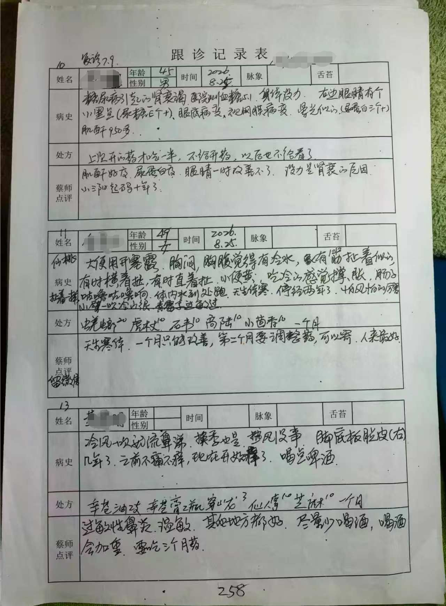

*（图 12：纸质"跟诊记录表"原件 — 含 3 则病历：第 10 则（熊某，男，45 岁）、第 11 则（金某，女，49 岁）、第 13 则（蒋某，33 岁））*

把这种纸拍照上传，系统能自动识别"病史 / 处方 / 医师点评"等栏目，写入医案数据库。

---

> 🎉 **恭喜！你已经掌握了医案系统的全部基础操作。**
> 接下来推荐：
> 1. 把科室常用的方剂维护进 **数据字典 → 方剂**，保存为模板
> 2. 用 **系统管理 → 用户管理** 给每位医师开账号
> 3. 让"数字员工"接管批量录入：从今往后只拍照，对话框里说一句就行

> 🟢 文档版本：v1.0.0 · 适用于中医医案管理系统 v1.0.0
